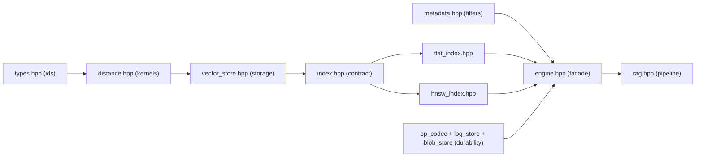
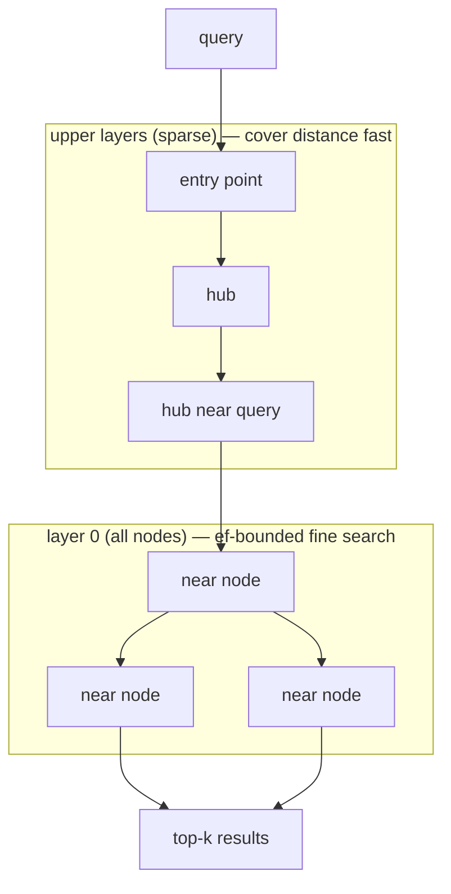
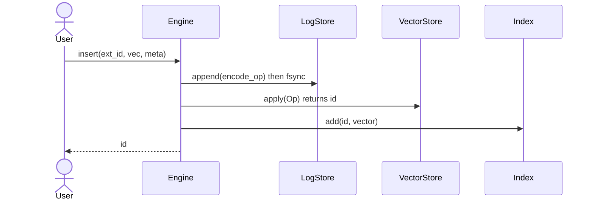
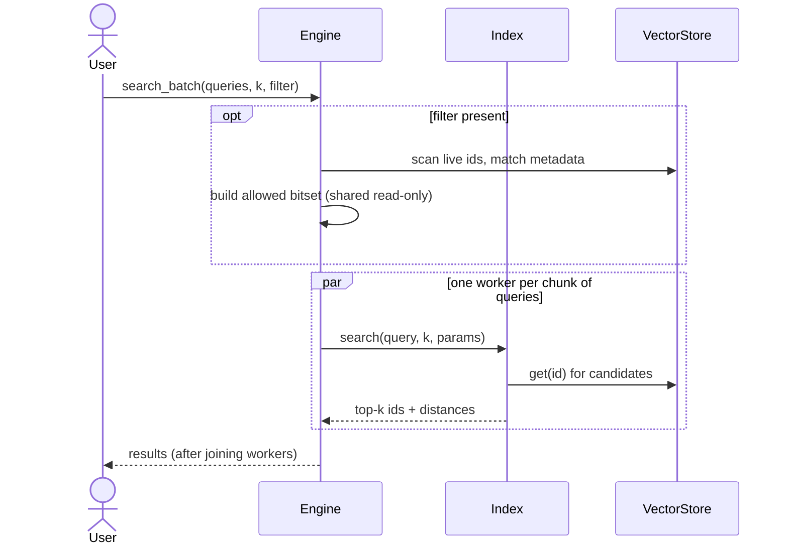
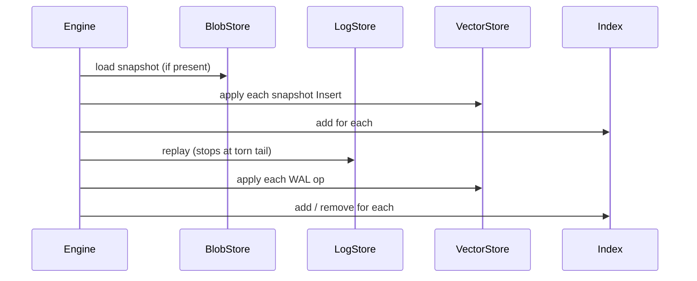

# Code Tour

A guided, reading-order walkthrough of the implementation. If `DESIGN.md` is the
"why", this is the "how" — read it top to bottom and you'll understand the codebase
without opening every file. Each section links the real source and quotes the load-
bearing parts.

> **New to vector databases?** Keep [GLOSSARY.md](GLOSSARY.md) open alongside this — it
> defines every jargon term (arena, embedding, HNSW, ef, WAL, recall, tombstone, ...) in
> plain English. Terms below are defined there.

## How to read this repo

Everything is built in dependency order, so read it in that order:



| File | Role |
|------|------|
| `include/toyvdb/types.hpp` | ids, `Score`, `SearchResult`, the distance convention |
| `include/toyvdb/distance.hpp` | L2 / cosine / dot kernels as compile-time policies |
| `include/toyvdb/metadata.hpp` | `MetaValue`, composite `Filter` tree |
| `include/toyvdb/vector_store.hpp` `.cpp` | SoA arena, ids, tombstones, the `Op` apply seam |
| `include/toyvdb/index.hpp` | `Index` interface + `SearchParams` |
| `include/toyvdb/flat_index.hpp` | exact brute-force index (the oracle) |
| `include/toyvdb/hnsw_index.hpp` `src/hnsw_index.cpp` | the HNSW graph ANN index |
| `include/toyvdb/op_codec.hpp` `.cpp` | serialize an `Op` to/from bytes |
| `include/toyvdb/log_store.hpp` `.cpp` | append-only WAL (`FileLogStore`) |
| `include/toyvdb/blob_store.hpp` `.cpp` | snapshot blob store (`FileBlobStore`) |
| `include/toyvdb/engine.hpp` `src/engine.cpp` | the facade: ops, durability, parallel search |
| `include/toyvdb/rag.hpp` `src/rag.cpp` | chunker, embedding adapter, retriever, prompt builder |

---

## 1. Foundations: ids and the distance convention

`types.hpp` defines the vocabulary. Two ideas matter:

- **Internal ids are dense `uint32_t`** assigned in insert order — they index the arena
  directly. User-facing ids are strings, mapped to internal ids by the store.
- **`SearchResult::score` is a distance, and *smaller means closer*** — for every metric.

That second rule is enforced in `distance.hpp`. Metrics are **compile-time policies**
(structs with a `static distance(...)`), constrained by a concept so misuse is a clear
compile error:

```cpp
template <class M>
concept DistanceMetric = requires(const float* a, const float* b, Dim d) {
    { M::distance(a, b, d) } -> std::same_as<Score>;
};

struct L2 {
    static Score distance(const float* a, const float* b, Dim d) {
        Score sum = 0;
        for (Dim i = 0; i < d; ++i) { const Score diff = a[i] - b[i]; sum += diff * diff; }
        return sum;  // squared; monotonic with true L2, avoids a sqrt
    }
};
```

Cosine returns `1 - similarity` and dot returns `-similarity`, so all three sort the same
way (ascending = best first). This kills the single most common vector-search bug: mixing
similarity and distance orderings. Because the metric is a template parameter, the kernel
**inlines** into the search loop — no virtual call on the hot path. A `MetricKind` enum +
factory bridges to runtime selection where needed.

---

## 2. Storage: the vector store and the `Op` seam

`vector_store.hpp` is the storage layer, and it introduces the most important abstraction
in the whole project — the **logical op**:

```cpp
enum class OpType : std::uint8_t { Insert = 1, Update = 2, Delete = 3 };

struct Op {
    OpType             type;
    std::string        ext_id;
    std::vector<float> vec;   // empty for Delete
    Metadata           meta;  // empty for Delete; optional for Update
};
```

Every mutation funnels through `VectorStore::apply(const Op&)`. The public `insert/update/
erase` methods are just sugar that build an `Op` and call `apply`. This single choke point
is what later makes durability trivial: the WAL logs the `Op`, the store applies it, the
index derives from it.

Vectors live in **one contiguous arena** (Structure-of-Arrays), so vector `i` is at
`arena[i*dim .. (i+1)*dim)` — one allocation, cache-friendly, SIMD-ready:

```cpp
std::vector<float>        arena_;    // slot_count()*dim_, row-major
std::vector<std::uint8_t> live_;     // 1 = live, 0 = tombstoned
std::vector<std::string>  ext_ids_;  // internal id -> external id
std::unordered_map<std::string, InternalId> ext_to_int_;
```

Insert appends to the arena and assigns the next dense id — but re-inserting an existing
external id **revives its slot** instead of allocating a new one:

```cpp
InternalId VectorStore::do_insert(const std::string& ext_id, std::span<const float> vec,
                                  const Metadata& meta) {
    validate_dim(vec);
    if (const auto it = ext_to_int_.find(ext_id); it != ext_to_int_.end()) {
        const InternalId id = it->second;                 // slot reuse
        std::copy(vec.begin(), vec.end(), arena_.begin() + static_cast<std::ptrdiff_t>(id)*dim_);
        meta_[id] = meta;
        if (!live_[id]) { live_[id] = 1; ++live_count_; }  // revive a tombstone
        return id;
    }
    const InternalId id = static_cast<InternalId>(ext_ids_.size());
    arena_.insert(arena_.end(), vec.begin(), vec.end());
    /* push live_/ext_ids_/meta_, map ext->id, ++live_count_ */
    return id;
}
```

**Deletion is a tombstone** (`live_[id] = 0`) — O(1), no arena shifting. Reads return an
O(1) `std::span` into the arena; `is_live` / `resolve` respect tombstones. That's the
whole storage layer: dense ids, one arena, tombstones, an op seam.

---

## 3. Metadata and the filter tree

`metadata.hpp` stores per-vector metadata as `unordered_map<string, variant<int64,double,
string,bool>>` and provides a small **composite filter** built with named factories:

```cpp
auto f = Filter::all_of({
    Filter::eq("lang", std::string("en")),
    Filter::ge("year", std::int64_t{2023}),
    Filter::negate(Filter::eq("draft", true)),
});
bool ok = f.matches(meta);   // recursive evaluation; missing key => leaf is false
```

Leaves are `eq/ne/lt/le/gt/ge/in`; internal nodes are `all_of` (AND), `any_of` (OR),
`negate` (NOT). The engine turns a filter into an allowed-set bitset before searching
(section 6).

---

## 4. The index contract and the Flat oracle

`index.hpp` is the polymorphic boundary every index implements:

```cpp
struct SearchParams { std::size_t ef = 64; const Bitset* allowed = nullptr; };

class Index {
public:
    virtual void add(InternalId id, std::span<const float> vec) = 0;
    virtual void remove(InternalId id) = 0;
    virtual std::vector<SearchResult> search(std::span<const float> q, std::size_t k,
                                             const SearchParams&) const = 0;
};
```

Indexes **store ids only** and read vectors back from the store — that separation is why
Flat and HNSW can share data and be compared head-to-head.

`flat_index.hpp` is the exact, brute-force implementation and the project's **correctness
oracle**: HNSW is validated against it. The core is a bounded max-heap of size `k`:

```cpp
// top() == current worst kept result (largest distance); evict it when a closer one arrives
for (const InternalId id : ids_) {
    if (!store_.is_live(id)) continue;                                  // skip tombstones
    if (params.allowed && !params.allowed->test(id)) continue;          // metadata filter
    const Score dist = M::distance(q, store_.get(id).data(), d);
    if (heap.size() < k)            heap.push({id, dist});
    else if (dist < heap.top().score) { heap.pop(); heap.push({id, dist}); }
}
// drain heap back-to-front => results ascending by distance
```

Note the two `continue`s: tombstone-awareness and metadata filtering live here and are
reused, conceptually, by HNSW.

---

## 5. HNSW — the heart of the project

`hnsw_index.hpp` implements Malkov & Yashunin's algorithm (arXiv:1603.09320). A node holds
one neighbour list per layer it lives on:

```cpp
struct Node { int level; std::vector<std::vector<InternalId>> links; };  // links[l] = layer l
```

The graph is layered: upper layers are sparse "express lanes", the base layer holds every
node. A search enters at the top, greedily hops toward the query through the sparse layers,
then does a wider `ef`-bounded search at the base:



Four pieces do the work.

**(a) Layer assignment** — exponentially fewer nodes per higher layer (`mL = 1/ln M`):

```cpp
const double r = 1.0 - u(rng_);           // (0,1], so log is finite
return static_cast<int>(-std::log(r) * mL_);
```

**(b) `search_layer`** (Alg. 2) — the workhorse. A min-heap *frontier* drives exploration;
a bounded max-heap holds the best `ef` *results*. The filter twist: navigate through any
node, but only **admit** live + allowed nodes into results:

```cpp
const auto admit = [&](InternalId id) {
    return store_.is_live(id) && (allowed == nullptr || allowed->test(id));
};
while (!cand.empty()) {
    const Cand c = cand.top(); cand.pop();
    if (res.size() >= ef && c.dist > res.top().dist) break;   // frontier can't improve
    for (const InternalId e : nodes_[c.id].links[l]) {
        if (vis.test_set(e)) continue;
        const Score d = dist_to(q, e);
        if (res.size() < ef || d < res.top().dist) {
            cand.push({d, e});
            if (admit(e)) { res.push({d, e}); if (res.size() > ef) res.pop(); }
        }
    }
}
```

`vis` is an epoch-stamped visited set (`Visited`) that avoids reallocating/clearing per
call, and is allocated **per query** — which is exactly what makes concurrent search safe
(section 6).

**(c) `select_neighbors`** (Alg. 4 heuristic) — keep a candidate only if it's closer to the
query than to any already-chosen neighbour; this spreads links and lifts recall:

```cpp
for (const Cand& cand : cands) {
    if (result.size() >= m) break;
    bool keep = true;
    for (const Cand& r : result)
        if (Met::distance(cv, store_.get(r.id).data(), dim) < cand.dist) { keep = false; break; }
    if (keep) result.push_back(cand);
}
```

**(d) `add`** (Alg. 1) — pick a level, greedily descend the upper layers to the new node's
level, then at each layer from there down: `search_layer` → `select_neighbors` → connect
bidirectionally → prune neighbours back to `Mmax` (`2M` at layer 0, `M` above). The full
candidate set is carried down as the next layer's entry points:

```cpp
for (int lc = max_level_; lc > level; --lc) ep = greedy_upper(q, ep, lc);   // zoom in
std::vector<Cand> entries{ep};
for (int lc = std::min(level, max_level_); lc >= 0; --lc) {
    auto w = search_layer(q, entries, efConstruction, lc, nullptr, vis);
    auto neighbors = select_neighbors(w, M);
    for (auto& nb : neighbors) connect(id, nb.id, lc);
    for (auto& nb : neighbors) prune(nb.id, lc, max_links(lc));
    if (!w.empty()) entries = std::move(w);
}
```

`search` mirrors this: greedy-descend to layer 1, then one `search_layer` at layer 0 with
`ef = max(params.ef, k)`. **Deletion is a soft tombstone** — `remove()` is a no-op; the
node stays for routing but `admit` filters it out of results (true deletion would break
graph connectivity). Recall is tuned by `efSearch` and measured against Flat.

---

## 6. The Engine — facade, write path, parallel search

`engine.cpp` ties storage + index together and owns durability. The key method is
`apply_op`, the **write-ahead** path: log first, then mutate memory, then update the index:

```cpp
InternalId Engine::apply_op(const Op& op, bool log_it) {
    if (log_it && wal_) wal_->append(encode_op(op));   // durable BEFORE memory changes
    switch (op.type) {
        case OpType::Insert: { auto id = store_.apply(op); index_->add(id, store_.get(id)); return id; }
        case OpType::Update:   store_.apply(op); return kInvalidId;   // index reads live vec
        case OpType::Delete: { auto id = store_.resolve(op.ext_id); store_.apply(op);
                               if (id) index_->remove(*id); return kInvalidId; }
    }
}
```

Filtered search builds the allowed-set bitset once, then delegates to the index:

```cpp
Bitset allowed(store_.slot_count());
for (InternalId id = 0; id < store_.slot_count(); ++id) {
    if (!store_.is_live(id)) continue;
    const Metadata* m = store_.metadata(id);
    if (m != nullptr && filter->matches(*m)) allowed.set(id);
}
params.allowed = &allowed;
```

**Parallel search** (`search_batch`) is the performance flex. Because `search` is `const`
with per-query scratch, concurrent reads are race-free. Queries are partitioned into
contiguous chunks across `std::jthread` workers; the allowed-set is shared read-only:

```cpp
const auto run_range = [&](std::size_t lo, std::size_t hi) {
    SearchParams params; if (ef) params.ef = ef; if (has_filter) params.allowed = &allowed;
    for (std::size_t i = lo; i < hi; ++i)
        results[i] = index_->search({queries[i].data(), queries[i].size()}, k, params);
};
// spawn tcount jthreads over chunks, then:
for (auto& w : workers) if (w.joinable()) w.join();   // join BEFORE reading results
return results;
```

The join-before-return is the correctness point: all writes to `results` happen-before the
caller reads it. The model is single-writer / immutable-on-read.

---

## 7. Persistence — codec, WAL, snapshot, recovery

Three small pieces compose into durability.

**Op codec** (`op_codec.cpp`) serializes an `Op` to bytes:
`[u8 type][u32 ext_len][ext][ if !Delete: u32 dim, dim×f32, u32 meta_count, entries...]`.

**WAL** (`log_store.cpp`) is an append-only file of length-prefixed, CRC-checked records.
Append frames `[crc][len][payload]` and fsyncs per `SyncPolicy`. Replay is the durability
guarantee — it stops at the first torn/corrupt record, which can only be the tail after a
crash:

```cpp
payload.resize(len);
if (len > 0 && !read_exact(payload.data(), len)) break;     // torn payload at tail
if (crc32({payload.data(), len}) != crc) break;             // corruption: stop here
on_record({payload.data(), len});                           // durable prefix is intact
```

**Snapshot + recovery** live in the Engine. A snapshot folds live state into a blob as a
sequence of framed `Insert` ops (reusing the codec) and truncates the WAL. Recovery replays
the snapshot, then the WAL tail — and because the index is a derived view, replaying inserts
**rebuilds the graph for free**:

```cpp
void Engine::recover() {
    if (blobs_ && blobs_->exists("snapshot")) replay_blob(blobs_->get("snapshot"));
    if (wal_) wal_->replay([&](std::span<const std::byte> rec) {
        apply_op(decode_op(rec), /*log_it=*/false);          // re-apply without re-logging
    });
}
```

This is event sourcing: the op log is the source of truth, the store and index are
materialized views.

---

## 8. RAG — chunk, embed, retrieve, prompt

`rag.cpp` builds the retrieval pipeline on top of the Engine.

**Chunker** — sliding window over whitespace tokens with overlap; `step = window - overlap`
(clamped ≥ 1) so consecutive chunks share `overlap` tokens.

**Embedding adapter** — `EmbeddingModel` is an interface (real deployments wrap a model/API).
`MockEmbeddingModel` is deterministic and offline: signed feature hashing of tokens + L2
normalize, so texts that share words land close in cosine space:

```cpp
for (const std::string& tok : tokens) {
    if (tok.size() < 3) continue;                              // crude stopword filter
    const std::uint64_t h = fnv1a(tok);
    v[h % dim_] += ((h >> 63) & 1ULL) ? 1.0F : -1.0F;          // signed hashing
}
// then divide by L2 norm
```

**RagEngine** ingests by chunking, embedding, and storing each chunk with `doc`/`text`
metadata; retrieves by embedding the query, running vector search, and mapping ids back to
chunk text:

```cpp
std::size_t RagEngine::ingest(const Document& doc) {
    const std::vector<Chunk> chunks = chunk_text(doc.text, cfg_.chunk);
    for (std::size_t i = 0; i < chunks.size(); ++i) {
        Metadata meta;
        meta["doc"]  = doc.id;
        meta["text"] = chunks[i].text;
        engine_.insert(doc.id + "#" + std::to_string(i), model_.embed(chunks[i].text),
                       std::move(meta));
    }
    return chunks.size();
}
```

**PromptBuilder** assembles a grounded prompt under a token budget, reserving room for the
query + template and greedily adding the closest chunks until the budget is hit. See
`examples/rag_demo.cpp` for the end-to-end flow you can run.

---

## 9. Three request flows, end to end

**Insert (durable)** — log first, then mutate memory, then update the index:



**Search (filtered, parallel)** — build the allowed-set once, then fan queries across threads:



**Recovery (startup)** — replay the snapshot, then the WAL tail; the index rebuilds itself:



---

## 10. Where to start, and the test map

Start at `examples/rag_demo.cpp` (the whole system in ~40 lines), then read in the order of
the table above. The tests are runnable specifications — read them alongside each component:

| Test file | Pins down |
|-----------|-----------|
| `tests/test_distance.cpp` | metric correctness, symmetry, edge cases |
| `tests/test_vector_store.cpp` | insert/get, tombstone, revive, op model |
| `tests/test_metadata_filter.cpp` | leaves + AND/OR/NOT/in, missing keys |
| `tests/test_flat_index.cpp` | exact ordering, k edge cases, filtered search |
| `tests/test_hnsw.cpp` | recall ≥ 0.9 vs Flat oracle, graph invariants |
| `tests/test_persistence.cpp` | codec round-trips, reopen, snapshot, torn-tail recovery |
| `tests/test_parallel.cpp` | parallel results == serial; thread-safety |
| `tests/test_rag.cpp` | chunk overlap, embedding, retrieval relevance, budgeting |

The recall-vs-latency and QPS-vs-concurrency numbers come from `bench/recall_harness.cpp`.
