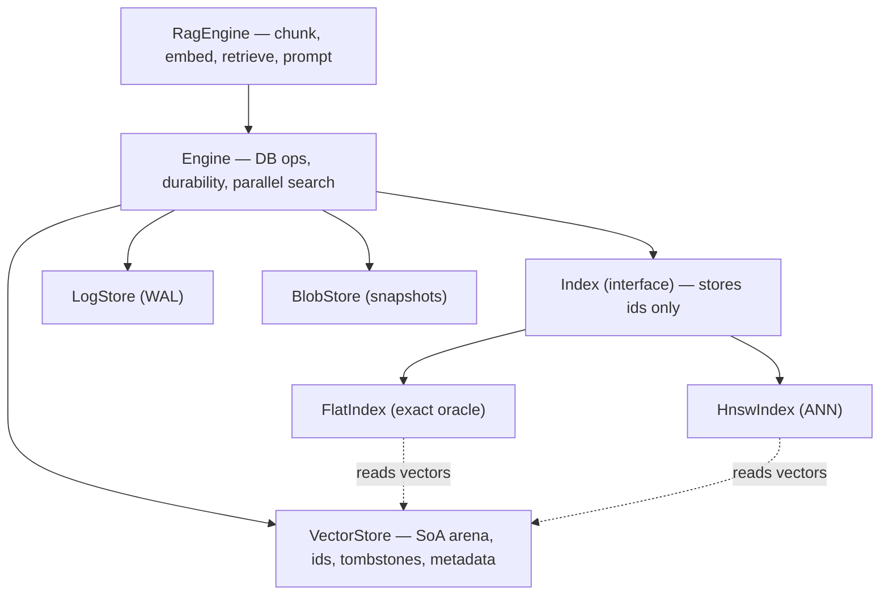
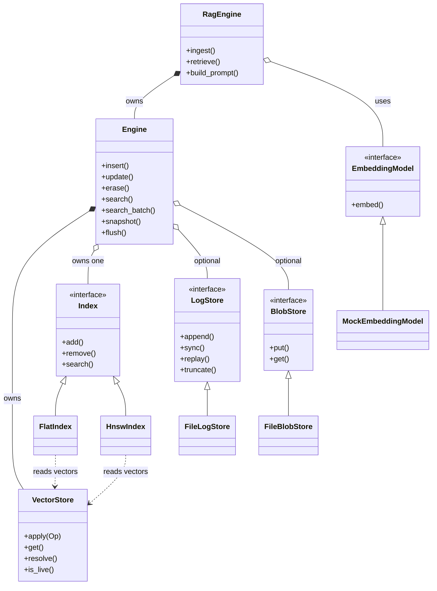
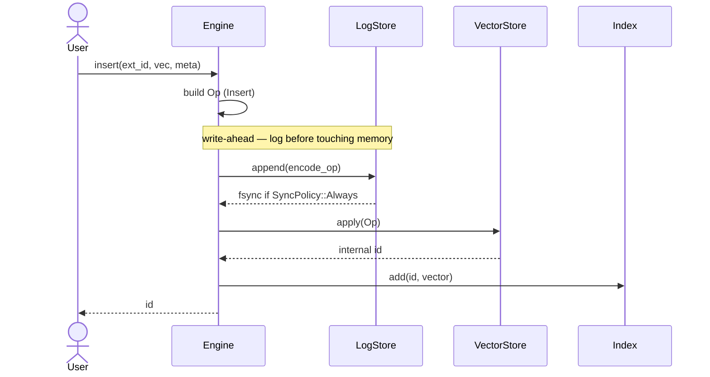
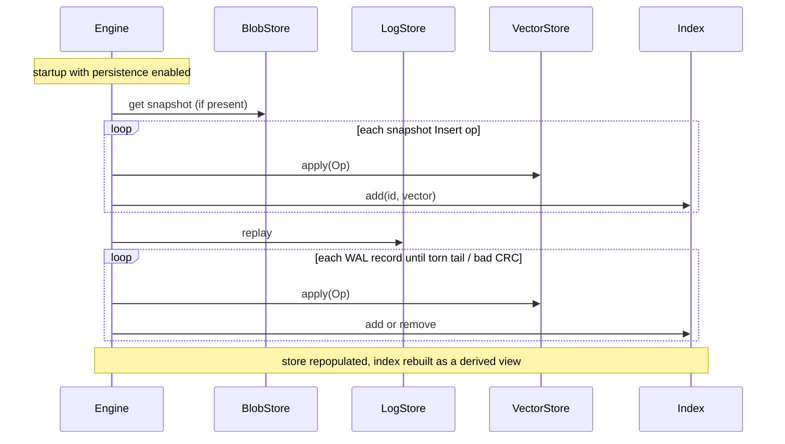

# Design

`toy-vector-db` is a single-node, in-memory vector database + RAG engine in C++20,
built to learn how vector databases work internally. This document covers the design
decisions that matter; the README has the feature list and benchmark numbers.

## Layering

## Class diagram

## The one decision everything hangs on: storage / index separation

The index never owns vectors. It stores **internal dense ids** (`uint32_t`) only and
reads vectors back from the `VectorStore` on demand. This is why we can:

- run Flat and HNSW over the *same* data (Flat is the recall oracle for HNSW),
- keep HNSW graph nodes tiny and cache-friendly,
- treat deletion, metadata, and durability as storage concerns, not index concerns.

## ID scheme

External ids (user strings) map to dense internal ids assigned in insert order.
Vectors live in one contiguous `float` arena (Structure-of-Arrays), so vector `i`
occupies `arena[i*dim .. (i+1)*dim)` — one allocation, cache-friendly, SIMD-ready.
Internal id values are not stable across a recovery (see WAL) or a compaction, but
external ids are.

## The logical op model (the durability seam)

Every mutation is one of three logical ops — `Insert` / `Update` / `Delete` — applied
through `VectorStore::apply(Op)`. This single contract is what makes durability and
storage pluggable:

- the WAL serializes the `Op` and appends it before memory is touched (write-ahead),
- the store materializes the op,
- the index is a **derived view** updated from the same op.

Replaying the op log reconstructs state exactly. This is event-sourcing applied to a
vector DB, and mirrors how real engines (Qdrant, LSM stores) treat the log as truth.

## WAL + recovery

- Records are length-prefixed and CRC-32 checked: `[crc][len][payload]`.
- `SyncPolicy` is `Always` (fsync per append), `GroupCommit` (batch, then `flush()`),
  or `Off` (page cache only).
- A **snapshot** folds current live state into a blob (framed `Insert` ops, reusing the
  op codec) and truncates the WAL, so recovery = load snapshot + replay WAL tail.
- Recovery is **torn-write safe**: replay stops at the first short/CRC-bad record
  (expected only at the tail after a crash); everything before it is durable.
- The HNSW graph is *not* persisted; it is rebuilt by replaying inserts. Simpler and
  always correct; persisting the graph is a future optimization for large datasets.

## Distance metrics

L2 / cosine / dot are compile-time policies (`template<DistanceMetric>`), so the kernel
inlines into the search loop with no virtual dispatch. The convention is **smaller ==
closer** for every metric (L2 squared; cosine = `1 - sim`; dot = `-sim`), which removes
the most common vector-search bug — mixing similarity and distance orderings — and makes
top-k uniformly "keep the k smallest".

The `Index` boundary, by contrast, is virtual: it is crossed once per query, so dispatch
cost is irrelevant there. Hot path = compile-time policy; cold path = virtual.

## HNSW

Follows Malkov & Yashunin (arXiv:1603.09320): probabilistic layer assignment
(`mL = 1/ln M`), greedy descent through upper layers, `ef`-bounded base-layer search, the
neighbour-selection heuristic, and bidirectional connect with pruning to `Mmax`
(`2M` at layer 0, `M` above). Search recall is tuned by `efSearch` and traced against the
Flat oracle as a recall-vs-latency Pareto curve.

Deletion is a **soft tombstone**: the node stays in the graph for routing/connectivity
but is excluded from results via the store's `is_live` check. True deletion would break
connectivity; `Engine::compact()` is the fix — it rebuilds the store and index from the
live nodes only, dropping tombstones and reclaiming their memory.

Filtered search builds an allowed-set bitset from the metadata filter; the base-layer
search navigates through all nodes (for connectivity) but only admits allowed+live nodes
into results. Highly selective filters degrade toward a fuller traversal — the known
filtered-ANN tradeoff.

## Concurrency

`search` is `const` and allocates per-query scratch (HNSW's visited set is local), so the
read path has no shared mutable state. `search_batch` partitions queries across
`std::jthread` workers over the immutable index, with the filter bitset computed once and
shared read-only. The model is **single-writer / immutable-on-read**: safe for concurrent
queries with no concurrent mutation. A lock-free RCU read path (atomic snapshot publish +
epoch reclamation) is the deliberate next step, not the starting point.

## RAG

Documents are split by a sliding-window chunker (configurable window/overlap). Chunks are
embedded through an `EmbeddingModel` adapter — the one component intentionally *not* built
from scratch, since embedding generation is an ML concern that adds no vector-DB insight;
a deterministic mock (signed feature hashing + L2 normalize) keeps the path offline and
testable. Chunks are stored with `doc`/`text` metadata; retrieval embeds the query, runs
vector search, and maps ids back to chunk text. The prompt builder injects the closest
chunks under a token budget, reserving room for the query and template.

## Deliberately out of scope

IVF, hybrid BM25 + RRF, cross-encoder reranking, a REST/gRPC server, SIMD kernels, and
lock-free reads — each is a clean extension point (`Index` impl, fusion stage, transport,
distance backend) but none changes the core lesson. Kept out to stay focused.
