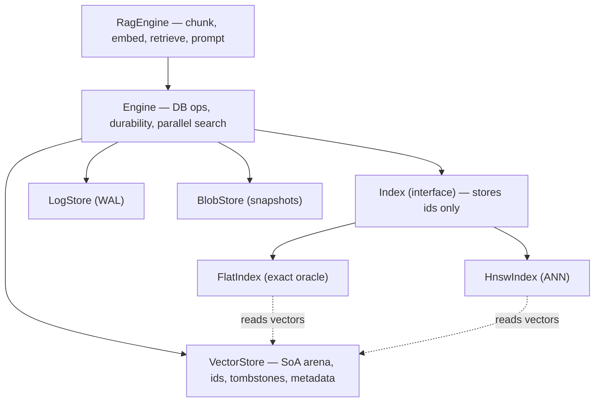

# toy-vector-db

An in-memory **vector database + RAG engine** built from scratch in modern **C++20**, for
learning how vector databases, ANN indexing, and retrieval systems work internally.

This is intentionally a *simplified* in-memory cousin of FAISS / Qdrant: single-node,
in-memory, no external vector-DB libraries. Embedding generation may call an external
model; storage, indexing, and retrieval are all hand-built.

## Scope (locked)

| Area | In | Notes |
|------|----|-------|
| In-memory vector store | yes | SoA arena, dense `u32` ids, tombstone delete |
| Distance kernels | yes | cosine / L2 / dot (scalar) |
| Flat index | yes | exact, the correctness oracle |
| HNSW index | yes | graph build, layer assignment, ef-search, neighbour heuristic, filtered search |
| Metadata filtering | yes | composite filter tree (eq/ne/range/in + and/or/not), filtered ANN |
| WAL persistence | yes | CRC records, fsync policies, recovery, snapshot + replay |
| Multi-threaded search | yes | parallel batch queries over the immutable read path; QPS-vs-concurrency benchmark |
| RAG pipeline | yes | sliding-window chunker, embedding adapter, retriever, token-budgeted prompt builder |
| REST API + web console | yes | JSON HTTP server (cpp-httplib) + single-page UI for all ops |
| IVF / hybrid search | no | deliberately out of scope to stay focused |

## Architecture

The single most important design choice: a **hard seam between storage and indexing**.
All mutations flow through a small logical **op model** (`Insert` / `Update` / `Delete`).
The WAL serializes ops, the store applies them, and indexes are *derived views* over the
store. This is event-sourcing-flavoured and makes the storage backend pluggable.



Dashed edges mark the **durability seams** (WAL append, snapshot/recover, replay): they
sit off the hot read path and are detailed below.

Extension seams already in place:
- `LogStore` / `BlobStore` interfaces (file impls now; object-store later) for the WAL
  and snapshots — runtime polymorphism, only crossed off the hot path.
- Distance metrics are compile-time policies (no vtable in the inner loop).
- The index is a derived view, so the storage backend can change without touching query code.

## Build

Primary toolchain: **Apple Clang (C++20)**. Secondary CI target: **g++-15**.

```sh
cmake -S . -B build -DCMAKE_BUILD_TYPE=RelWithDebInfo
cmake --build build -j
ctest --test-dir build --output-on-failure
```

Build with g++-15 (portability check):

```sh
cmake -S . -B build-gcc -DCMAKE_CXX_COMPILER=g++-15
cmake --build build-gcc -j
```

Run the recall/latency harness:

```sh
./build/bench/recall_harness
```

Run the RAG demo (offline, deterministic mock embeddings):

```sh
./build/examples/rag_demo
```

### REST API + web console

A small HTTP server (cpp-httplib + nlohmann/json, fetched by CMake) exposes the engine
over JSON and serves a single-page UI to drive every operation from the browser:

```sh
./build/server/toyvdb_server          # listens on http://localhost:8080
./build/server/toyvdb_server 9000     # or pick a port
```

Open <http://localhost:8080> for the console (insert/search/delete vectors, ingest
documents, RAG search + prompt, live stats). Endpoints:

| Method | Path | Body | Purpose |
|--------|------|------|---------|
| GET | `/api/stats` | – | sizes, dim, index type |
| POST | `/api/vectors` | `{id, vector:[4 floats], metadata?}` | insert/update a vector |
| POST | `/api/search` | `{vector:[...], k?, ef?, filter?}` | nearest-neighbour search |
| DELETE | `/api/vectors/:id` | – | delete a vector |
| POST | `/api/documents` | `{id, text}` | RAG ingest (chunk → embed → store) |
| DELETE | `/api/documents/:id` | – | remove a document and all its chunks |
| POST | `/api/rag/search` | `{query, k?}` | retrieve relevant chunks |
| POST | `/api/rag/prompt` | `{query}` | retrieve + build a grounded prompt |

```sh
curl -s localhost:8080/api/stats
curl -s -X POST localhost:8080/api/vectors -d '{"id":"a","vector":[0,0,0,0],"metadata":{"lang":"en"}}'
curl -s -X POST localhost:8080/api/search  -d '{"vector":[0,0,0,0],"k":3,"filter":{"lang":"en"}}'
```

The raw-vector store is fixed at dim 4 (L2 / HNSW) for easy hand-typing; the RAG side uses
the mock embedding. All engine access is serialised behind one mutex (the single-writer
model). Disable with `-DTOYVDB_BUILD_SERVER=OFF`.

See [DESIGN.md](DESIGN.md) for the architecture and the key design decisions, and
[CODE_TOUR.md](CODE_TOUR.md) for a reading-order walkthrough of the implementation. New to
the topic? [GLOSSARY.md](GLOSSARY.md) explains every jargon term (vector, embedding, arena,
HNSW, WAL, recall, ...) in plain English.

### Multiple datasets / dimensions

Dimension is fixed per `Engine` (one `Engine` = one collection, like a Qdrant collection or
a FAISS index). For datasets of different dimensions, use a separate `Engine` for each —
dimensions can't be mixed, since distance is only defined between equal-length vectors:

```cpp
Engine images(EngineConfig{512, MetricKind::Cosine, IndexKind::Hnsw});
Engine docs  (EngineConfig{768, MetricKind::Cosine, IndexKind::Hnsw});
```

## Status

All planned features complete. The system is a simplified in-memory FAISS/Qdrant in
modern C++20:

- **Storage**: SoA arena, dense ids, tombstone delete, logical op model;
  `Engine::compact()` reclaims tombstoned slots and rebuilds the derived index.
- **Indexes**: exact Flat (oracle) and **HNSW** (graph ANN with filtered + soft-delete
  search).
- **Filtering**: composite metadata filter tree resolved to an allowed-set bitset.
- **Durability**: **WAL** of the logical op stream + snapshot + crash recovery; the
  index is a derived view rebuilt by replaying the log.
- **Concurrency**: multi-threaded batch search over the immutable read path.
- **RAG**: sliding-window chunker -> embedding adapter -> retrieval -> token-budgeted
  prompt builder.

100 GoogleTest cases; clean build under Apple Clang 21 and g++-15.

Representative numbers (clustered synthetic set, N=20k, dim=128, k=10):
- HNSW recall@10 ~1.0 at efSearch=80, ~20-35x faster than the exact Flat scan.
- Multi-threaded search scales ~6.5x at 8 threads: 17.7k -> 115.6k QPS on a 12-core machine.

Possible extensions: lock-free RCU read path, SIMD (NEON/AVX2) kernels, IVF index,
and hybrid BM25 + RRF search.

## References

- HNSW: Malkov & Yashunin, *Efficient and Robust ANN Search Using Hierarchical Navigable Small World Graphs*, arXiv:1603.09320.
- BM25: Robertson & Zaragoza, *The Probabilistic Relevance Framework: BM25 and Beyond*, 2009.
- RAG: Lewis et al., *Retrieval-Augmented Generation for Knowledge-Intensive NLP Tasks*, NeurIPS 2020.
